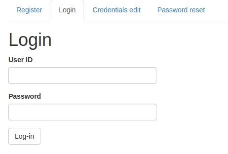
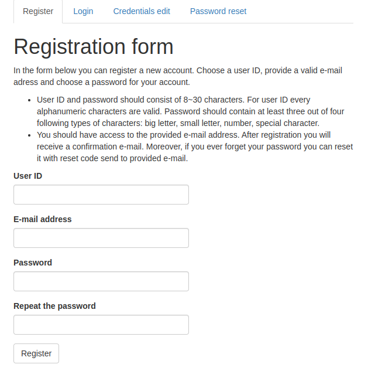
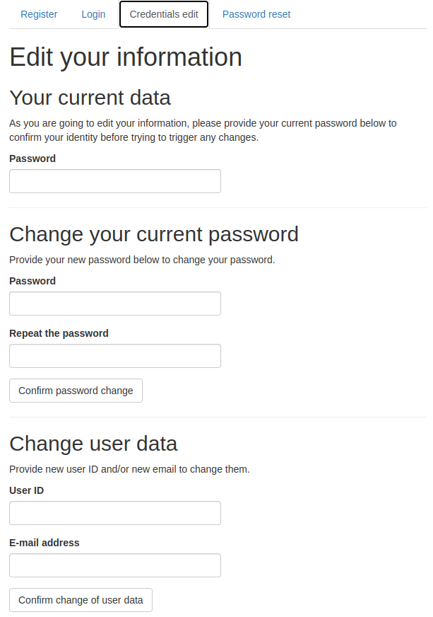
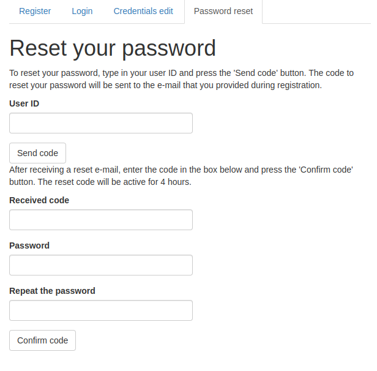

<!-- README.md is generated from README.Rmd. Please edit that file -->

```{r, include = FALSE}
knitr::opts_chunk$set(
  collapse = TRUE,
  comment = "#>",
  fig.path = "man/figures/README-",
  out.width = "100%"
)
```

# shiny.reglog

<!-- badges: start -->
[](https://lifecycle.r-lib.org/articles/stages.html)
[](https://CRAN.R-project.org/package=shiny.reglog)
[](https://cranchecks.info/pkgs/shiny.reglog)
[](https://cran.r-project.org/package=shiny.reglog)
[](https://cran.r-project.org/package=shiny.reglog)
[](https://app.codecov.io/gh/StatisMike/shiny.reglog?branch=master)
<!-- badges: end -->

## 1. Introduction

The user authentication in Shiny applications can be very useful. Mainly, user can 
login to read and write some results of their session into relational database.

On the other hand, it may be handy for your App to allow access of unregistered
users. If you need to secure your ShinyApp, there are better alternatives
([shinymanager](https://github.com/datastorm-open/shinymanager){target="_blank"} or 
[shinyauthr](https://github.com/PaulC91/shinyauthr){target="_blank"})

This package contains modules to use in your Shiny application allowing you to 
automatically insert boxes for login, register, credentials edit and password 
reset and procedures.

*shiny.reglog* supports as data containers either databases accessed with
`RSQLite`, `RMariaDB`, `RMySQL` and `RPostgreSQL` drivers or googlesheets-based
database (accessed by `googlesheets4` package).

It is highly recommended to use one of the `DBI`-supported databases, though. It
is much more optimized and secure, as the database is never loaded as a whole
into the memory, but queried as needed. *googlesheets* database is much easier to
set-up, but it shouldn't be used when you are expecting big userbase.

Registration, credentials edit and password reset procedures programmatically 
send email to the user of your ShinyApp - to welcome them, inform about change
of their user ID and/or email and to give them a reset code to reset their 
password. *shiny.reglog* supports two methods of email sending: via `emayili`
or `gmailr` packages. Both of them have their pros and cons, depending on your
accesses: `emayili` allows for usage of many SMTP servers, while `gmailr` allowing
using *gmail* messaging via Google REST API. 

The `emayili` is recommended for most applications. `gmailr` can be useful
if you already have application registered and authorized with mail sending
scope.

Currently the package is after major change in its code - basically full rewrite
to allow more security, usage of more databases and more customization. Past 
functions are still available in current version, but will 
generate deprecation warnings. 

## 2. Basic structure 

There are three main objects that are to be used when implementing *RegLog* system
for login and registration in your ShinyApp. All of them need to be defined
in the *server* code.

- *dbConnector*: one of `RegLogDBIConnector` or `RegLogGsheetConnector`. It will handle
all writes, edits and inputs to the users database.
- *mailConnector*: one of `RegLogEmayiliConnector` or `RegLogGmailrConnector`. It
will handle all automatical emailing to the user emails.
- *RegLogServer*: The main module producing and controlling all of UI and 
reactivity of the login and registration system. It uses *dbConnector* and
*mailConnector* for actions external of R.

## 3. Installation

You can install this version of shiny.reglog from GitHub with:

```{r installation, eval=FALSE}
# install version 0.5.0 from GitHub 
install.packages("devtools")
devtools::install_github("StatisMike/shiny.reglog")

# or install old version from CRAN
# install.packages("shiny.reglog")
```

## 4. Setting up *dbConnector*

You need to create *dbConnector* object to be used by the *RegLogServer* to 
write and read user data from the database.

To set-up the database for *RegLog* system, you can use helper functions
included in this package. They are tested and guarantee compatible structure
of the data.

### 4.1 Googlesheet database method (*RegLogGsheetConnector*)

1. Create googlesheet file on your googledrive to support database. You can use
`gsheet_tables_create()` function, which by default creates empty spreadsheets
configured correctly.

```{r creating gsheet, eval = F}
# create googlesheet and gather its id for later usage
# you can also specify optional 'name' argument for custom gsheet name

gsheet_id <- gsheet_tables_create()

# save you gsheet_id - you need to provide it later to your dbConnector
```

If you wish to import some existing credentials, you can do it by giving the 
`data.frame` object to the `user_data` argument:

```{r, eval = F}
# get some credentials
credentials <- data.frame(
  username = "ShinyReglogTest",
  password = "VeryHardPassword",
  email = "shinyreglog@test"
  )

# create gsheet database with some credentials
gsheet_id <- gsheet_tables_create(
  user_data = credentials,
  # as the password was not hashed with `script` before, it need to be
  # hashed now
  hash_passwords = T)

```

2. Configure googlesheets4 package to use out-of-band (non-interactive) auth. For more information about it visit [googlesheets4 documentation](https://googlesheets4.tidyverse.org/).

3. In the `server` part of your ShinyApp define `RegLogGsheetConnector` to provide it
afterwards to the `RegLogServer` object

```{r, eval = F}
server <- function(input, output, session) {
  
  dbConnector <- RegLogGsheetConnector$new(
    gsheet_ss = gsheet_id)
  
}
```

### 4.2 `DBI` compatible SQL database (*RegLogDBIConnector*)

*RegLog system* out of the box supports *SQLite*, *MySQL*, *MariaDB* and *PostgreSQL*
databases. You can use `DBI_tables_create` function, which by default creates empty 
tables configured correctly.

```{r creating SQLite, eval = F}
# create a connection to the database. Remember to use user with CREATE TABLE
# scope enabled when useing MySQL, MariaDB or PostgreSQL connection

conn <- DBI::dbConnect(
  RSQLite::SQLite(),
  dbname = "reglog_db.sqlite"
)

# using this connection create the tables.
DBI_tables_create(conn = conn)

# disconnect from the database after creation
DBI::dbDisconnect(conn)
```

If you wish to import some credentials, you can do it by providing the `data.frame` 
object to the `user_data` argument:

```{r, eval = F}
# get some credentials
credentials <- data.frame(
  username = "ShinyReglogTest",
  password = "VeryHardPassword",
  email = "shinyreglog@test")

conn <- DBI::dbConnect(
  RSQLite::SQLite(),
  dbname = "reglog_db.sqlite"
)

# create database using the connection
DBI_tables_create(conn = conn,
                  user_data = credentials)

DBI::dbDisconnect(conn)
```

2. In the *server* part of your ShinyApp define `RegLogDBIConnector` to provide it
afterwards to the `RegLogServer` object.

```{r, eval = F}
server <- function(input, output, session) {
  
  dbConnector <- RegLogDBIConnector$new(
    driver = RSQLite::SQLite(),
    dbname = "reglog_db.sqlite")
  
}
```

## 5. Setting up mail connectors

You need to create *mailConnector* object to be used by the *RegLogServer* to 
write and read user data from the database. There are two classes defined to use
`emayili` or `gmailr` packages as backend.

### 5.1. Using `emayili` (*RegLogEmayiliConnector*)

This backend is recommended to use. It supports many SMTP servers, mostly
with username and password based identification.

```{r, eval = F}
server <- function(input, output, session) {
  
  mailConnector <- RegLogEmayiliConnector$new(
    from = "email@sending.com",
    # to learn how to setup emayili smtp server read ?emayili::server
    smtp = emayili::server(...)
  )
  
}
```

### 5.2. Using `gmailr` (*RegLogGmailrConnector*)

This backend is only viable if you have an app registered in Google Cloud Console.
It authorizes and sends email via gmail REST API, needing Oauth authorization
with high scopes.

```{r, eval = F}
server <- function(input, output, session) {
  
  mailConnector <- RegLogGmailrConnector$new(
    from = "email@gmail.com"
  )
  
}
```

## 6. Setup *RegLogServer*

All of **RegLog system** is generated and maintained by the object of class 
`RegLogSystem` in unison with *dbConnector* and *mailConnector* of your
choosing.

Its setup is pretty straightforward:

```{r, eval = F}
server <- function(input, output, session) {
  
  RegLog <- RegLogServer$new(
    # both of these elements need to be defined firstly or in this call
    dbConnector = dbConnector,
    mailConnector = mailConnector
  )
}
```

Besides these two mandatory arguments, there are also some additional arguments
to be used for customization.

- `app_name`: your application name. It will be used within emails send to users.
If not specified, the name of the folder containing you application files will be
used.
- `app_address`: URL address to your application. It will be used within emails
send to users. If not specified, the email address contained within *session$clientData*
will be used.
- `lang`: language to be used in UI elements and send emails. Defaults to 'en'
for *English*. Currently also 'pl' for *Polish* is supported. Besides that, you
can also specify 'i18' to generate only text indicators - external methods can
be used to parse the message in given language can be then used (eg. `shiny.i18n`
package).
- `custom_txts`: named list with character strings of custom texts to be used
by the system. For more information call `?RegLog_txt`.
- `use_modals`: either boolean indicating if all default modalDialogs should be shown
or named list of `FALSE` values inhibiting specific ones. For more information
read **RegLogServer object fields and methods**, section **Message**. All modals
are listed there alongside conditions of their appearance.
- `module_id`: character string with ID of the module. Recommended to leave
as default - unless if that name is taken by another module.

### 6.1. Retrieve information from **RegLogServer**

After setting up and assigning the object your application logic can observe
status of user in current session by public fields containing *reactiveVal*
objects.

```{r, eval = F}
## if you assigned the RegLogServer to 'RegLog' object, as in examples above:

# boolean showing if the user is logged in:
RegLog$is_logged()

# character vector containing user ID: either specific to the user if logged
# in, or unique anonymous ID generated with 'uuid::UUIDgenerate()'
RegLog$user_id()

# character vector containing user email if logged in
RegLog$user_mail()

# integer of the account ID inside the database - for identifying the logged user
# across relative tables
RegLog$account_id()
```

>There are much more to be learned about RegLogServer object - for more information
read **RegLogServer object fields and methods**. Above information is enough
for basic setup.

## 7. Insert UI elements

Every part of the UI is generated by *RegLogServer*, and could be accessed by
provided functions containing `tagList`.

### 7.1. Login UI

Providing GUI to allow logging in if user is already registered to your 
application.



```{r, eval = F}
RegLog_login_UI()
```

### 7.2. Register UI

Providing GUI for registering new account.

- Both user ID and e-mail needs to be unique within the databasa
- user ID need to consist of 8-30 alphanumeric characters
- user password need to consist of 8-30 characters. It needs to contain characters
of at least 3 of 4 following groups:
  - small letter
  - big letter
  - number
  - special character
- user email is also validated

After account registration, user will receive confirmation email on their password.



```{r, eval = F}
RegLog_register_UI()
```

### 7.3. Credentials edit UI

Providing GUI for changing credentials.

- user need to be logged in to change their data
- to confirm their identity, they need to provide their current password
- user can change either during one interaction:
   - password
   - user ID and/or e-mail 
- same checks as in register procedure are conducted
- after user ID and/or e-mail change user will receive confirmation e-mail



```{r, eval = F}
RegLog_credsEdit_UI()
```

### 7.4. Reset password UI

Providing GUI for password reset.

- in the case of user forgetting their password, they can reset it by providing
their user ID
- mail message containing reset code will be sent to the user
- inputing the reset code from e-mail will allow password change
- same password check for new password is conducted as in register procedure



```{r, eval = F}
RegLog_resetPass_UI()
```

## 8. Additional information

- You can access demonstration shinyApp with showcase mode on 
[shinyapps.io](https://statismik.shinyapps.io/shinyreglog_demo/){target="_blank"}
- You can run interactive demo in your own RStudio by using `RegLogDemo()` 
function. It will use mocked *mailConnector* by default or *RegLogEmayiliConnector* 
if you provide it arguments required by `emayili` backend.
- For more information read vignettes.

