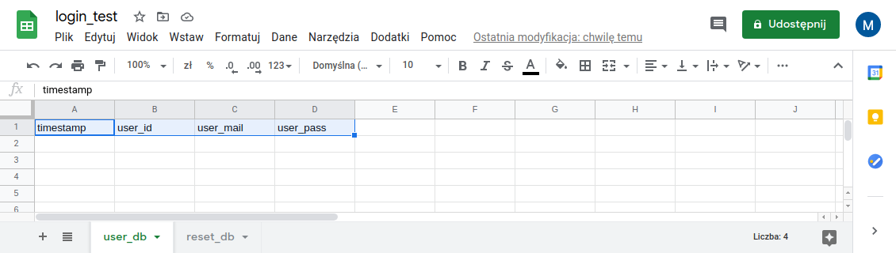
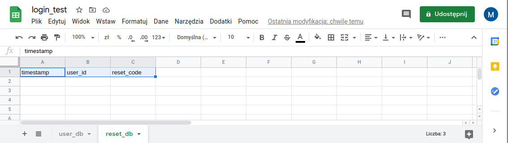
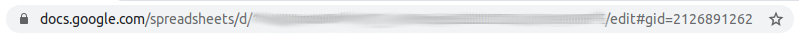

<!-- README.md is generated from README.Rmd. Please edit that file -->

```{r, include = FALSE}
knitr::opts_chunk$set(
  collapse = TRUE,
  comment = "#>",
  fig.path = "man/figures/README-",
  out.width = "100%"
)
```

# shiny.reglog

<!-- badges: start -->
[](https://www.tidyverse.org/lifecycle/#stable)
<!-- badges: end -->

## 1. Introduction

The user authentication in Shiny applications can be very useful. Mainly, user can 
login to read and write some results of their session into relational database.

On the other hand, it may be handy for your App to allow access of unregistered
users. If you need to secure your ShinyApp, there are better alternatives
(mainly [shinymanager package](https://github.com/datastorm-open/shinymanager))

This package contains modules to use in your Shiny application allowing you to 
automatically insert boxes for login, register and password reset procedure. It
currently supports two methods for database containers:

- googlesheets for easy of use (via `googlesheets4` package)
- SQLite database for security and faster use, though basic understaning of
SQL queries is required (via `DBI` and `RSQLite` packages)

Both registration and password reset procedures require confirmation email
to verify the user. The package allows two methods of mail sending:

- via `emayili` package for more flexibility and easier setup but less security
- via `gmailr` package, allowing usage of popular gmail accounts. This method is
more secure but the setup can be more tricky

Currently the package went into stable state, as it have potential of growth
without danger of breaking changes. In the future I plan to widen the usability:

1. Easier access for adding other language support for contributors rather than hard-coding them into main module codes
2. Some kind of admin / levels of authorization for users
3. Passphrase for SQLite database
4. Automated initial creation of googlesheet4 and SQLite database for usage with modules

## 2. Installation

You can install this version of shiny.reglog from GitHub with:

```{r installation, eval=FALSE}
install.packages("devtools")
devtools::install_github("StatisMike/shiny.reglog")
```

## 3. Setup

To use the contents of this package, you need to take some steps outside of R. The setup varies with the chosen methods for implementation.

### 3.1 Googlesheet database method

1. Create a valid googlesheet in your googledrive storage space.

    Created googlesheet should consists of at least two sheets, as this version of shiny.reglog uses them (though the googlesheet can contain as many extra sheets as you want). The required sheets need to be as follows:

  * user_db sheet with four columns, named: timestamp, user_id, user_mail and user_pass
  
    
  
  * reset_db sheet with three columns, named: timestamp, user_id, reset_code

    

  * During that step you can also copy the ID of your spreadsheet. It will be needed for login_server() module, and you can get it from the URL of spreadsheet. ID is the character string in the blurred portion on the image below:
  
    

2. Configure googlesheets4 package to use out-of-band auth. For more information about it visit [googlesheets4 documentation](https://googlesheets4.tidyverse.org/)

### 3.2 SQLite database method

Create an SQLite database that your Shiny App will have access to. After installation of `DBI` and `RSQlite` packages which are needed for using this method, it can be made from the R console itself.

```{r creating SQLite, eval = F}

#firstly, creating a connection will automatically create SQLite file

conn <- DBI::dbConnect(RSQLite::SQLite(), "path_to_your_db.sqlite")

# create user_db table
RSQLite::dbExecute(conn,
                   "CREATE TABLE user_db (
                   timestamp INTEGER,
                   user_id TEXT PRIMARY KEY,
                   user_mail TEXT,
                   user_pass TEXT
                   );")

# create reset_db table
RSQLite::dbExecute(conn,
                   "CREATE TABLE reset_db (
                   timestamp INTEGER,
                   user_id TEXT PRIMARY KEY,
                   reset_code TEXT")

# remember to disconnect after using database!
RSQLite::dbDisconnect(conn)

```

## 4. Information about functions

All functions generates text (input labels, descriptions, authomatic e-mail). You can control the language of displayed text with `lang` argument. Currently it supports English (the default) and Polish (`lang = "pl"`). If you want to use non-default language, you need to set the 'lang' argument consistently between all functions of the package.

### 4.1. UI functions

All UI functions creates a `div` element which can be input into UI of your application, inside a `fluidRow`, complete `fluidPage`, `tabItem` of dashboard or any other container of your choosing.

#### 4.1.1. register_UI

The register box contains inputs for user ID (which can be used to link the user with other elements in external databases), e-mail address (which will be used to send confirmation e-mail and reset codes for your password) and for password and password repetition. It tests validity of all inputs and tries to register new account after pushing the "Register" button.

It produces modal dialog detailing the result. Additionally, if registered successfully it sends user a confirmation e-mail.

Currently the functions accept user ID and password consisting of 8~25 alphanumeric characters. It is planned to change in future iterations to widen the requirements - especially for passwords.

Provided password is saved in hashed form - using the `scrypt::hashPassword` function.


#### 4.1.2. login_UI

The login box contains inputs for user ID and password. After pushing the "Login" button, it check validity of inputs and logins user. Produces modal dialog detailing results.


#### 4.1.3. password_reset_UI

The box for password reset consists of two UI elements: the password_reset_UI `div` element and modal dialog it produces after confirming validity of inputted confirmation code.

The main `div` contains input for User ID. After user inputs their ID, they should push "Send code" button, which generates their 24h-valid resetcode mails it to their e-mail and stores in hashed form in the database.

After they receive reset code, they need to input it in the next inputbox below and push next button. The validity of inputted code in relation to user ID is then checked. If correct, the new modal dialog opens to input the new password.


The user need to provide new password and repeat it to check for any typos. After pushing the "Confirm new password" button, below input boxes a message is rendered to give feedback to the user - if the password was changed successfully. After that, the user can close modal dialog with "OK" button.


### 4.2. Server function

Currently there is only one server function: login_server()

```{r login_server, eval = FALSE}
login_server(
  id = "login_system", 
  db_method = c("gsheet", "sqlite"), 
  mail_method = c("emayili", "gmailr"),
  appname,
  appaddress,
  lang = "en",
  gsheet_file,
  sqlite_db,
  gmailr_user,
  emayili_user,
  emayili_password,
  emayili_host,
  emayili_port
  )
```

#### 4.2.1. Arguments

`login_server` arguments can be divided into three main groups:

##### 4.2.1.1 General arguments: always mandatory

These arguments are always mandatory while using `login_server`

+ *id* argument defaults to "login_system". You can use different name - but remember to keep it consistent for all functions
+ *db_method* specify which database method you want to use. At this moment there are two methods for databases: `gsheet` and `sqlite`
+ *mail_method* specify which e-mailing method you want to use. At this moment there are two methods fo e-mailing: `gmailr` and `emayili`
+ *appname* is the character string with title of your application
+ *appaddress* is the character string with URL address of your application for your users to navigate from their confirmation mail
+ *lang* argument defaults to "en". It changes the language of your modules. Currently only one other option is available: "pl" for Polish

##### 4.2.1.2 Arguments specific to database methods

+ *gsheet_file* is the character string containing your googlesheets ID. Argument is mandatory when using `gsheet` database method
+ *sqlite_db* is the character string specifying path to your sqlite database path. Argument is mandatory when using `sqlite`

##### 4.2.1.3 Arguments specific to e-mail methods

+ *gmailr_user* is the character string of your gmail address that you wish the application to use for automatic e-mails. Used in `gmailr` mailing method

+ *emayili_user* is the character string of your email address, that is also used to log into your mailbox. Used in `emayili` mailing method, as the ones below. 
+ *emayili_password* is the character string of password that you use to log into your mailbox
+ *emayili_host* is the character string specifying the sending host of your mailbox (fe. `smtp.gmail.com` for gmail mailbox)
+ *emayili_port* is the character string containing the sending port of your mailbox (fe. `465` for gmail mailbox)


#### 4.2.2. Values

`login_server` function creates `reactiveValues` object containing three elements, describing the status of current sessions' active user.

+ *is_logged* returns a boolean indicating, if the user is anonymous (`FALSE`) or logged in (`TRUE`)
+ *user_id* returns a character string containing the ID specyfied during registration and used to log-in. When `is_logged = F` it countains the timestamp of time when the anonymous user began his session. It can be used to link specific activities and outputs generated by the same person.
+ *user_mail* returns a character string containing the email address provided during registration. It can be used for automatic sending the user some kind of e-mails (fe. containing the results of some analysis after using your ShinyApp). When `is_logged = F` it contains the empty string value (`""`)

Additionally, it stores the tibbles of `user_db` and `reset_db` content under `session$userData` inside `reactive_db` object of `reactiveValues` class.

```{r active_user example, eval = FALSE}
# save the output in the server function of you application

auth <- login_server(...)

# you can check if currently the user is logged

isTRUE(auth$is_logged)

# moreover, you can check what is the ID and mail of currently logged user

user_data <- list(
  ID = auth$user_id,
  mail = auth$user_mail
)

```

## 5. Examples

Examples of `shiny.reglog` implementation with varying methods for database and e-mail implementation both in base `shiny` and `shinydashboard` are contained within `examples` folder.

## 6. User feedback

As it is package in very early development, please give any feedback after using it. Open new *Issues* or mail any suggestions to [my e-mail](mailto:statismike@gmail.com?subject=shiny.reglog)
