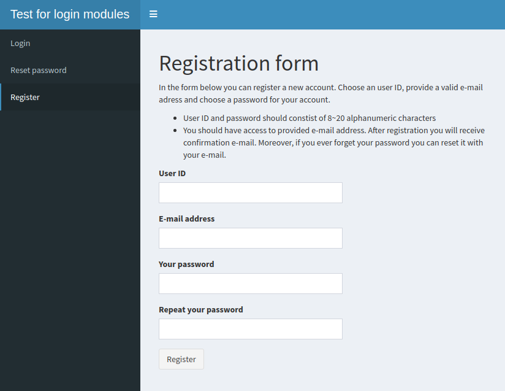
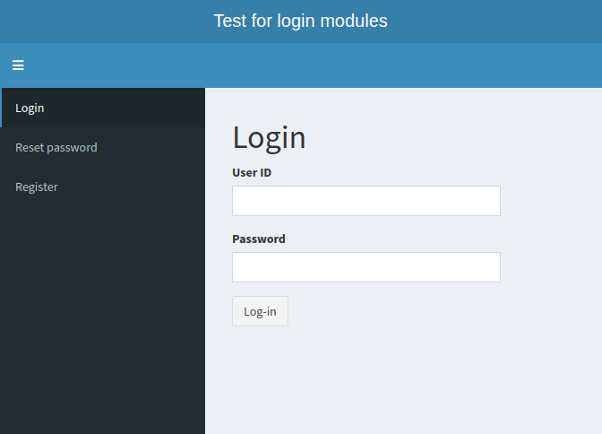
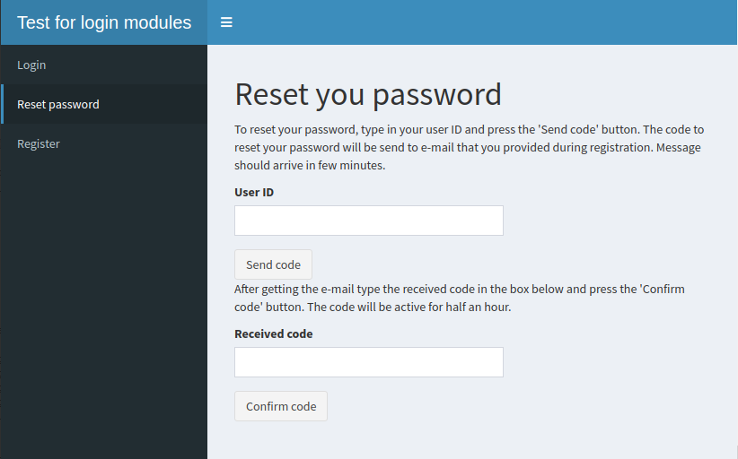
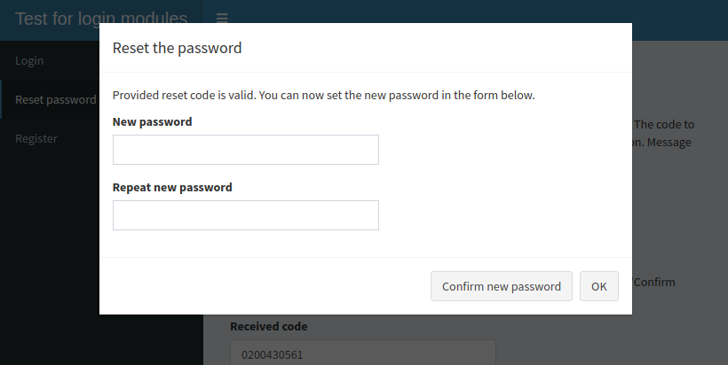

<!-- README.md is generated from README.Rmd. Please edit that file -->

# shiny.reglog

<!-- badges: start -->

[](https://www.tidyverse.org/lifecycle/#experimental)
<!-- badges: end -->

## 1\. Introduction

The user authentication in Shiny applications can be very useful.
Mainly, user can login to read and write some results of their session
into relational database.

This package contains modules to use in your Shiny application allowing
you to automatically insert boxes for login, register and password reset
procedure. At this point of development it supports only user database
contained within googlesheet document in you googledrive account, so it
requires usage of googlesheet4 package.

Currently the package is minimal working prototype. In the future I plan
to widen the usability:

1.  more localizations for user database locations than googlesheet
2.  customizations of database (fe: authorisation levels)
3.  widen the requirements for user ID and password

## 2\. Installation

You can install this version of shiny.reglog from GitHub with:

``` r

install.packages("devtools")
devtools::install_github("StatisMike/shiny.reglog")
```

## 3\. Setup

To use the contents of this package, you need to take some steps outside
of R.

1.  Create a valid googlesheet in your googledrive storage space.
    
    Created googlesheet should consists of at least two sheets, as this
    version of shiny.reglog uses them (though the googlesheet can
    contain as many extra sheets as you want). The required sheets need
    to be as follows:

<!-- end list -->

  - user\_db sheet with four columns, named: timestamp, user\_id,
    user\_mail and user\_pass
    
    

  - reset\_db sheet with three columns, named: timestamp, user\_id,
    reset\_code
    
    

  - During that step you can also copy the ID of your spreadsheet. It
    will be needed for login\_server() module, and you can get it from
    the URL of spreadsheet. ID is the character string in the blurred
    portion on the image below:
    
    

<!-- end list -->

2.  Configure googlesheets4 package to use out-of-band auth. For more
    information about it visit [googlesheets4
    documentation](https://googlesheets4.tidyverse.org/)

## 4\. Information about functions

All functions generates text (input labels, descriptions, authomatic
e-mail). You can control the language of displayed text with ‘lang’
argument. Currently it supports English (the default) and Polish (lang =
“pl”). If you want to use non-default language, you need to set the
‘lang’ argument consistently between all functions of the package.

### 4.1. UI functions

All UI functions creates a div() element which can be input into UI of
your application, inside a fluidRow(), complete fluidPage(), tabItem()
of dashboard or any other container of your choosing.

#### 4.1.1. register\_UI()

The register box contains inputs for User ID (which can be used to link
the user with other elements in external databases), E-mail address
(which will be used to send confirmation e-mail and reset codes for your
password) and for password and password repetition. It tests validity of
all inputs and tries to register new account after pushing the
“Register” button.

It produces modal dialog detailing the result. Additionally, if
registered successfully it sends user a confirmation e-mail.

Currently the functions accept user ID and password consisting of 8\~20
alphanumeric characters. It is planned to change in future iterations to
widen the requirements - especially for passwords.

Provided password is saved in hashed form - using the
scrypt::hashPassword() function.



#### 4.1.2. login\_UI()

The login box contains inputs for user ID and password. After pushing
the “Login” button, it check validity of inputs and logins user.
Produces modal dialog detailing results.



#### 4.1.3. password\_reset\_UI()

The box for password reset consists of two UI elements: the
password\_reset\_UI div() element and modal dialog it produces after
confirming validity of inputted confirmation code.

The main div() contains input for User ID. After user inputs their ID,
they should push “Send code” button, which generates their 24h-valid
resetcode mails it to their e-mail and stores in hashed form in the
database.

After they receive reset code, they need to input it in the next
inputbox below and push next button. The validity of inputted code in
relation to user ID is then checked. If correct, the new modal dialog
opens to input the new password.



The user need to provide new password and repeat it to check for any
typos. After pushing the “Confirm new password” button, below input
boxes a message is rendered to give feedback to the user - if the
password was changed successfully. After that, the user can close modal
dialog with “OK” button.



### 4.2. Server function

Currently there is only one server function: login\_server()

``` r
login_server(id = "login_system", 
             gsheet_file, 
             gmail_user,
             gmail_password,
             appname,
             appaddress,
             lang = "eng")
```

#### 4.2.1. Arguments

  - *id* argument defaults to “login\_system”. You can use different
    name, but keep it consistent for all functions
  - *gsheet\_file* is the character string containing your googlesheets
    ID. Its location is described in Setup section of this document
  - *gmail\_user* is the character string of your gmail address that you
    wish the application to use for automatic e-mails
  - *gmail\_password* is the character string of your gmail account
    password
  - *appname* is the character string with title of your application
  - *appaddress* is the character string with URL address of your
    application for your users to navigate from their confirmation mail
  - *lang* argument defaults to “eng”. It changes the language of your
    modules. Currently only one other option is available: “pl” for
    Polish.

#### 4.2.2. Value

login\_server() function creates reactiveValues object containing three
dataframes.

  - *active\_user* after log-in contains logged user row from the
    database, consisting of *timestamp* (the date of account
    creation/password reset), *user\_id* (the character string of user
    ID), *user\_mail* (the character string of user e-mail address),
    *user\_pass* (the character string of hashed user password). If the
    user is not logged in, the *active\_user* value is “not\_logged”
  - *user\_db* contains the whole user database loaded from googlesheets
    file - filtered for one row for every user\_id (only the most
    recently created row)
  - *reset\_db* contains the whole reset\_db loaded from googlesheets -
    filtered as above

You can use it’s output mainly to access the active\_user data

``` r

# save the output in the server function of you application

reactive_db <- login_server()

# to access user ID you can use

reactive_db$active_user$user_id

# though remember to check if the active_user value isn't "user_logged"
```

## 5\. Example

This is the code for ShinyApp presented in images above.

``` r
library(shiny)
library(shinydashboard)
library(shiny.reglog)

UI <- dashboardPage(
  header = dashboardHeader(title = "Test for login modules"),
  sidebar = dashboardSidebar(
    sidebarMenu(
    menuItem("Login", tabName = "login"),
    menuItem("Reset password", tabName = "resetpass"),
    menuItem("Register", tabName = "register"))
  ),
  body = dashboardBody(
    tabItems(
      tabItem("login",
              fluidPage(login_UI())),
      tabItem("resetpass",
              fluidPage(password_reset_UI())),
      tabItem("register",
              fluidPage(register_UI()))
    )
  )
)

server <- function(input, output, session){
  
  googlesheets4::gs4_auth(email = "yourgdrive@gmail.com",
                          path = "your_json.json",
                          cache = "your/location/for/.secrets/",
                          use_oob = TRUE)
  
  reactive_db <- login_server(gsheet_file = "your_googlesheets_ID", 
                              gmail_user = "yourgmail@gmail.com",
                              gmail_password = "yourgmail",
                              appname = "Name of your application",
                              appaddress = "address_of_your.app.io")
  
}

shinyApp(ui = UI,
         server = server)
```

## 6\. User feedback

As it is package in very early development, please give any feedback
after using it. Maybe you have some suggestions or you faced some errors
while using the package? Mail them all to [my
e-mail](mailto:statismike@gmail.com)
